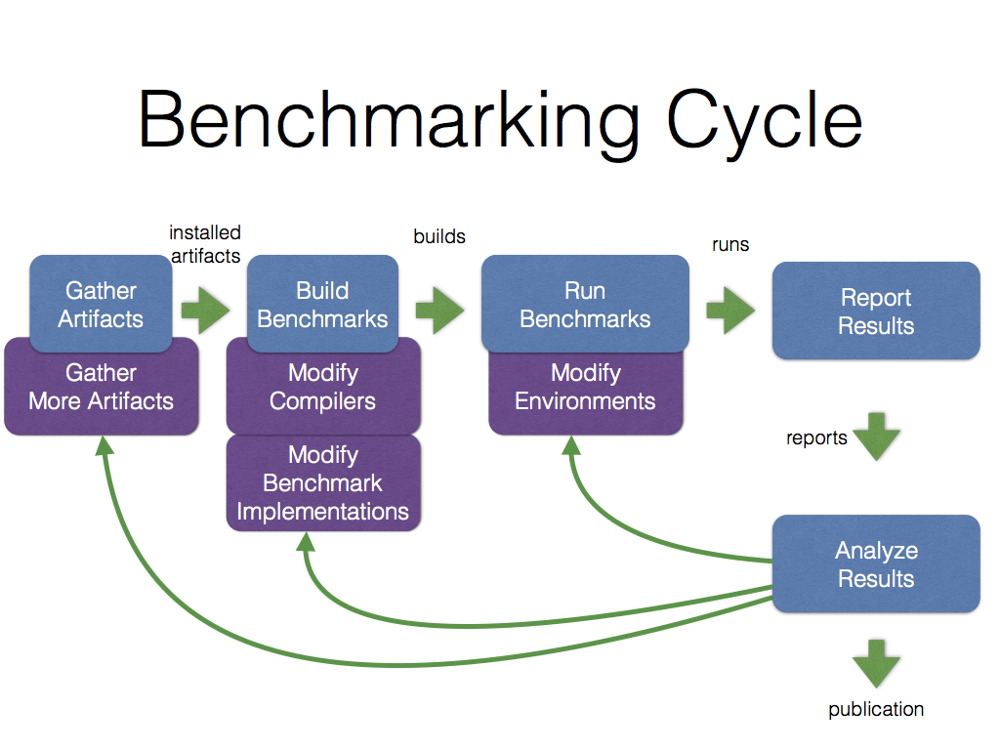

# Wu-Wei handbook

The [Wu-Wei benchmarking toolkit](https://github.com/Sable/wu-wei-benchmarking-toolkit) is (1) a set of conventions for organizing artifacts related to benchmarking on the file system and describing them using JSON files and (2) a set of commandline utilities for performing common benchmarking tasks with artifacts. The endgoal is to make benchmarking results drastically easier to obtain, replicate, compare, analyze, publish, etc. and to eventually obtain benchmarking commons similar to other package repositories (ex: Linux distributions or the npm ecosystem).

# Overview

The tools are built around the following conceptual cycle. Initially, artifacts (benchmarks, implementations, compilers, execution environments, etc.) are gathered into a repository from various sources (git repositories, file archives, directories on the file system, etc.). The different benchmark implementations, possibly in different programming languages, are then processed using compiler(s) that may translate them to another or the same language to obtain a build, an executable version of the benchmark and the configuration of artifacts that was used to create it. The build is then executed on an execution environment (natively on the operating system, in a virtual machine for a programming language, etc.) to obtain a run, the result of the execution and the associated metrics (time to completion, memory or energy used, etc.). In addition to the metrics the configuration of artifacts, the platform on which the build was executed, and the experience parameter are saved with the results for later reference and traceability. Finally, multiple runs may be aggregated into a single human-readable report (ascii, html, etc.) that summarizes the execution results, the metrics gathered, and comparisons between the different configurations used. Those reports may be used for academic publications, for internal reports, or self-publication online for collaboration with other people.

The process is linear for a simple replication study but in practice there are cycles between the different phases based on the feedback obtain from the reports. That may involve the gathering of more artifacts for comparison, the modification of existing implementations, compilers, or environments while keeping track of the previous versions. The cycle are repeated until the whole development/analysis process converges to an interesting result. The modified or newer versions of artifacts may then be shared online for others to be used directly, to replicate experiments, or to be extend/improved upon. 

The following figure summarizes the process. For reference and clarification, the terminology used throughout the document with associated definitions is given at the end of this document:

Conceptually, there are three major times for a benchmark implementation:
  - **Design Time**: when a modification may be made by a human or externally to the wu-wei cycle. It corresponds to the installation part of the cycle or happens right before the build phase.
  - **Static Time**: when a moditifcation may be done automatically using only information from the source code. It corresponds to the build phase of the cycle. 
  - **Run Time**: when a modification may be done automatically using the execution information. It corresponds to the run phase of the cycle.

During the build phase, an executable version of a benchmark, or build, is created from a combination of a benchmark, a specific implementation of that benchmark in a given programming language, a compiler, and experiment parameters. The combination of these artifacts and parameters is called a configuration. Alongside the executable version of the benchmark, a 'build.json' file is created that describes the configuration that was used to generate the build. A directory unique to the configuration is automatically created under the 'builds' directory of the repository by taking the hash of the string value of the representation.

During the run phase, the execution output of a build running on a given execution environment is produced with metrics on the execution. The metrics and configuration used to produce them are stored in a 'run.json' file in a directory named with the time at which the run happened, under the 'runs' directory of the repository. Inside that directory, files that may have been created as side-effects are stored under a directory '*run-hash*/*iteration-number*' where *run-hash* is the hash of the run configuration, and *iteration-number* is the index of the iteration that was run. An execution environment might run the same or multiple versions of an implementation before producing a result, therefore it might interleave multiple executions and compilation steps before converging to a final result. Intermediate files may be saved in the corresponding run directory. In the simplest and most common case however, it executes the implementation only once to gather metrics, such as execution time, and discards any output.

## Configuration elements

benchmark, implementation, compiler, environment, experiment, etc.

TODO

## Macro resolution on configuration

TODO

Conventions and the commandline interface of the tools are introduced in guides organized around high-level tasks related to benchmarking. The rest of this document provides quick references to the Wu-Wei concepts and conventions.

# Installing the tools

## (Recommended) Install nvm and activate a recent (>=6.3.1) version of Node.js
    
    curl -o- https://raw.githubusercontent.com/creationix/nvm/v0.31.4/install.sh | bash
    nvm use 6.3.1

## Install Wu-Wei

    git clone https://github.com/Sable/wu-wei-benchmarking-toolkit.git
    cd wu-wei-benchmarking-toolkit
    npm install
    npm link

# Specific guides

We suggest starting with the following introduction to obtain an overview of the tools and conventions used in Wu-Wei:
  
  - [Perform an experiment using existing artifacts](experiment-with-existing-artifacts.md)

After the introduction, the following guides can be read in any order:

  - [Replicate an experiment using an experiment description file](replicate-using-an-experiment-description-file.md)
  - [Create a new benchmark implementation](create-new-implementation.md)
  - [Create a new compiler](create-new-compiler.md)
  - [Create a new environment](create-new-environment.md)
  - [Leveraging compatibilities and dependencies between artifacts for easier evolution of artifacts](leveraging-compatible-artifacts.md)
  - [Port a benchmark from the PolyBench/C suite](port-polybench-benchmark.md)
  - [List of available artifacts](list-available-artifacts.md)

# Using Wu-Wei

The development of the Wu-Wei tools and the writing of this handbook is a labor of love and grew out of the frustration in the difficulty of reusing existing benchmarks and tools. The work is available free of charge in order to ensure timely dissemination and the widest impact. If any of this work has been useful to you for any of the followings tasks, we kindly ask you to contribute in the following ways:

## Used for an academic publication

TODO

## Used for an online publication (blog, social media posts, etc.)

TODO

## Used for performance evaluations in a for-profit company

TODO

## Used for projects with public visibility

TODO

# Quick reference for common tasks

| Task                                                                | Command(s)                             |
| :--------                                                           | :---------                             |
| Clear previous builds                                               | wu build --clear                       |
| Clear previous runs                                                 | wu run --clear                         |
| Initialize repository in an existing directory                      | wu init                                |
| List installed artifacts (initalize platform information if needed) | wu list                                |
| Show platform information                                           | wu platform                            |
| Save platform information for future runs non-interactively         | wu platform --save --short-name *name* |
| Show where a build is saved                                         | wu build -v                            |
| Show the execution output of runs                                   | wu run -v                              |
| Show the latest run outputs                                         | ls *repository-root*/runs/latest            |

# Common mistakes and fixes

| Symptom         | Cause                        | Fix                                                             |
| :-----          | :-----                       | :------                                                         |
| SyntaxError: Block-scoped declarations (let, const, function, class) not yet supported outside strict mode | You are using a version of node that is too old to support newer JavaScript constructs | Use nvm to activate a newer version (>= 6.3.1) by doing 'nvm use 6.3.1' |
| TODO            | Invalid JSON format for file | Use an online JSON format checker                                  |
| TODO            | Incorrect description file   | Read the Wu-Wei [config-schema.json](https://github.com/Sable/wu-wei-benchmarking-toolkit/blob/master/lib/config-schema.json) file to find the formatting mistake, search for the schema with the type attribute that corresponds to the artifact type |
| TODO            | Invalid output format for implementation runner | Use 'wu run -v' to show the execution output and fix the output using the [guidelines for new implementations]((create-new-implementation.md)) |

# Terminology

| Terminology      | Definition |
| :--------------- | :--------- |
| artifact         | Elementary component with a file representation and associated JSON meta-information |
| repository       | Collection of artifacts on the file system |
| action           | Operation that can be performed on artifact(s) |

| Artifacts        | Definition |
| :--------------- | :--------- |
| benchmark        | Abstract algorithm that performs a useful numerical task |
| build            | Runnable implementation that is ready to be executed on an environment and the configuration that was used to create it |
| compiler         | Program that processes a benchmark implementation to produce a new implementation (in the same or a different language) |
| configuration    | Combination of artifacts and their associated parameters necessary for performing an action |
| environment      | Additional virtualization layer executing on top of a platform (or another environment) a benchmark might execute on |
| experiment       | Combination of a configuration and experimental parameters that determine what, where, and how an implementation is to be executed |
| implementation   | Realization of a benchmark in a specific language (ex: C, assembly) and packaged in a particular format (ex: text file, binary, webpage) which might be directly runnable or not |
| platform         | Hardware and (native) OS combination for the machine to run benchmarks on |
| report           | Collection of figure(s) and the configuration that was used to produce them |
| run              | Execution report (ex: timing results, memory usage, etc.) and the experiment that produced it |

| Actions          | Definition |
| :--------------- | :--------- |
| building         | Creation, from a configuration, of an implementation that is executable on an environment |
| installing       | Retrieval, and initialization of an artifact in the repository |
| reporting        | Aggregation of multiple compatible runs, selection of significant results, and production of  human-readable figure(s) from those results |
| running          | Execution of an implementation on a stack of environment(s), and production of a run from the monitoring of its execution |

# Repository directory structure

| Directory             |            Content                                              |
| :-------------------- | :-------------------------------------------------------------- |
| .wu                   | Wu-Wei configuration and temporary files used during operations |
| benchmarks            | Benchmark artifacts under *short-name*/benchmark.json and their various implementations          |
| builds                | Each generated build has at least  *configuration-hash*/build.json with the configuration that generated the build and *configuration-hash*/executable with the executable version of an implementation |
| compilers             | Compiler artifacts under *short-name*/compiler.json and associated files |
| environments          | Execution environment artifacts under *short-name*/environment.json, their associated *short-name*/run script and other associated files |
| experiments          | Experiments under *short-name*/experiment.json |
| platforms             | Known platform configurations under *short-name*/platform.json |
| runs                  | Each generated run has at least *datetime*/run.json. Outputs from runs are stored under *datetime*/*configuration-hash*/*iteration-number* |

# Artifact Description JSON Formats

## Basic data types

## Canonical names for languages

## Benchmark

## Compiler

## Implementation

## Environment

## Experiment

## Platform

# Commandline interface reference

## wu build

usage: 

Purpose: create a build from a configuration

## wu init

usage:

Purpose: create an empty benchmarking repository

## wu install

usage:

Purpose: add and initialize an artifact in the repository

## wu platform

usage:

Purpose: list the current platform specification

## wu list

usage:

Purpose: find, verify, and list available artifact(s)

## wu run

usage:

Purpose: execute build(s) on compatible environment(s) and produce a run

## wu report

usage:

Purpose: aggregate run(s), select significant result(s), and produce a report

    
